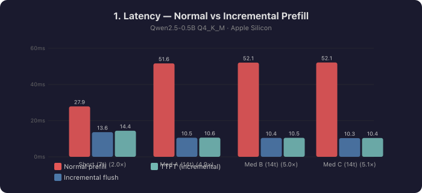
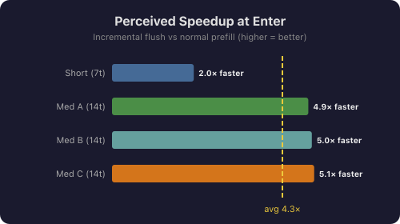
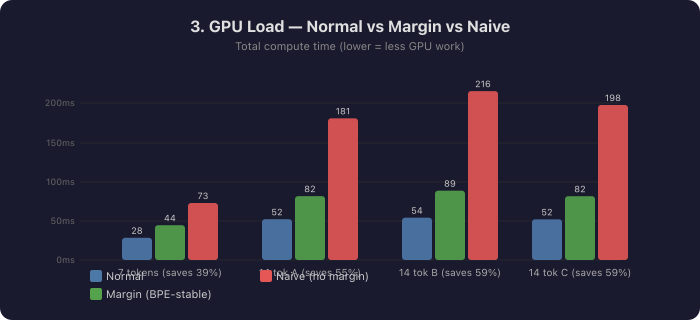
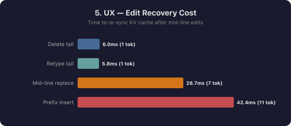
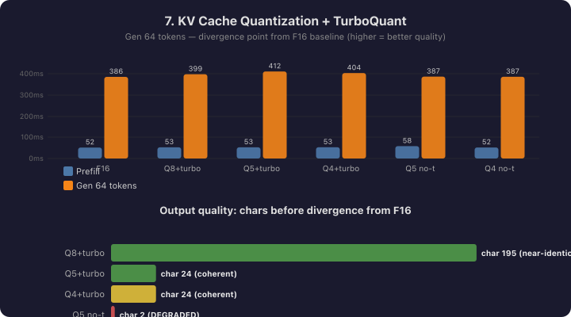
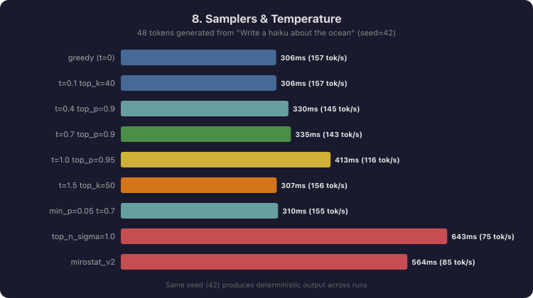

# 🦙 llama-cpp-rs

[](https://crates.io/crates/llama-cpp-4)
[](https://docs.rs/llama-cpp-4)
[](https://crates.io/crates/llama-cpp-4)

Safe Rust bindings to [llama.cpp](https://github.com/ggml-org/llama.cpp), tracking upstream closely.

| Crate | Description | crates.io |
|---|---|---|
| [`llama-cpp-4`](llama-cpp-4/) | Safe high-level API | [](https://crates.io/crates/llama-cpp-4) |
| [`llama-cpp-sys-4`](llama-cpp-sys-4/) | Raw bindgen bindings | [](https://crates.io/crates/llama-cpp-sys-4) |

**llama.cpp version:** `082b326f (b9951)` (Jul 2026) — includes
[TurboQuant (PR #21038)](#turboQuant--attention-rotation),
[MTP / multi-token-prediction speculative decoding (PR #22673)](https://github.com/ggml-org/llama.cpp/pull/22673), and
upstream **next-n** embedding hooks used by MTP (`llama_set_embeddings_nextn`).

---

## Using the library

```toml
[dependencies]
llama-cpp-4 = "0.4.1"
```

Import the common types with the prelude:

```rust
use llama_cpp_4::prelude::*;
```

Core types are also at the crate root (`llama_cpp_4::LlamaModel`, …). See
[`llama-cpp-4/README.md`](llama-cpp-4/README.md) for the full API guide and
[`prelude` on docs.rs](https://docs.rs/llama-cpp-4/latest/llama_cpp_4/prelude/index.html)
for runnable examples.

---

## Examples

| Package name | Directory | Description |
|---|---|---|
| `simple` | [`examples/simple/`](examples/simple/) | Single-turn text completion from CLI or Hugging Face |
| `chat` | [`examples/chat/`](examples/chat/) | Interactive multi-turn chat REPL |
| `embeddings` | [`examples/embeddings/`](examples/embeddings/) | Batch embedding with cosine similarity |
| `split-model-example` | [`examples/split_model/`](examples/split_model/) | Load sharded / split GGUF files |
| `openai-server` | [`examples/server/`](examples/server/) | OpenAI-compatible HTTP server — chat, completions, embeddings, tools, files (mtmd), tokenize |
| `mtmd` | [`examples/mtmd/`](examples/mtmd/) | Multimodal (vision / audio) inference (requires `--features mtmd`) |
| `quantize` | [`examples/quantize/`](examples/quantize/) | Quantize a GGUF model with full typed API |
| `turbo-quant` | [`examples/turbo-quant/`](examples/turbo-quant/) | TurboQuant demo — compare attn rotation on/off |
| `incremental-chat` | [`examples/incremental-chat/`](examples/incremental-chat/) | Chat with incremental prefill — processes tokens while you type |
| `mtp` | [`examples/mtp/`](examples/mtp/) | MTP speculative decoding via `MtpSession` (`--predict`, `--p-min`, draft loop) |

---

## Quick start

```bash
git clone --recursive https://github.com/eugenehp/llama-cpp-rs
cd llama-cpp-rs
```

### Interactive chat

```bash
cargo run -p chat -- \
    hf-model bartowski/Llama-3.2-3B-Instruct-GGUF Llama-3.2-3B-Instruct-Q4_K_M.gguf
```

### OpenAI-compatible server

```bash
# Starts on http://127.0.0.1:8080
cargo run -p openai-server -- \
    hf-model bartowski/Llama-3.2-3B-Instruct-GGUF Llama-3.2-3B-Instruct-Q4_K_M.gguf
```

Full REST API reference: [`examples/server/README.md`](examples/server/README.md).

| Method | Path | Description |
|--------|------|-------------|
| GET | `/health`, `/v1/health` | Liveness (no auth) |
| GET | `/v1/models` | Loaded model metadata |
| POST | `/v1/chat/completions`, `/chat/completions` | Chat · streaming · tools |
| POST | `/v1/completions`, `/completions` | Raw completion · streaming |
| POST | `/v1/embeddings`, `/embeddings` | L2-normalised embeddings |
| POST | `/tokenize`, `/detokenize` | [llama.cpp-compatible](https://github.com/ggml-org/llama.cpp/tree/master/tools/server) token helpers |
| POST/GET/DELETE | `/v1/files/...` | File store for multimodal (`--features mtmd`, `--mmproj`) |

Legacy paths without `/v1` mirror upstream [llama-server](https://github.com/ggml-org/llama.cpp/tree/master/tools/server).
Not implemented here (use upstream server instead): `/v1/responses`, `/v1/messages`, `/rerank`, `/slots`, `/props`.

### Using prebuilt native libraries (skip CMake compile)

`llama-cpp-sys-4` can consume precompiled llama/ggml libraries via env vars.
This is useful for CI pipelines that publish native artifacts once and reuse
them in downstream repos (for example, speeding up a separate app build).

```bash
# Directory containing prebuilt libs in one of:
#   <dir>, <dir>/lib, <dir>/lib64, <dir>/bin
export LLAMA_PREBUILT_DIR=/path/to/prebuilt

# Optional: force dynamic linking mode for prebuilt artifacts.
# Defaults to the crate's normal link mode for the active feature set.
# export LLAMA_PREBUILT_SHARED=1

cargo build -p your-app --features "q1,vulkan"
```

Notes:
- `q1` compatibility is determined by the prebuilt artifact itself — publish
  separate artifacts per feature/backend tuple (`q1+vulkan`, `q1+metal`, ...).
- `build.rs` still generates Rust bindings, but skips the expensive CMake
  compile when `LLAMA_PREBUILT_DIR` is set.

Backend feature coverage (practical targets):
- `metal`  → macOS (Apple Silicon and Intel Macs)
- `vulkan` → Linux/Windows (cross-vendor desktop GPUs)
- `webgpu` → Linux/Windows (experimental; requires Dawn/WebGPU-native stack)
- `cuda`   → Linux/Windows with NVIDIA CUDA toolkit (experimental in CI)
- `hip`    → Linux ROCm/HIP environments (experimental in CI)

### Prebuilt Feature Benchmark Results

The `prebuilt` feature flag provides automatic prebuilt artifact management. Benchmark results (Apple Silicon M2, macOS 14.4):

| Configuration | Build Type | Time | Improvement |
|---------------|------------|------|-------------|
| Base (Static) | Debug | 11.99s | Baseline |
| Base + `prebuilt` | Debug | 11.01s | **8% faster** |
| Dynamic Linking | Debug | 26.80s | -123% (slower) |
| Dynamic + `prebuilt` | Debug | 27.47s | -129% (slower) |
| Base (Static) | Release | 26.01s | Baseline |
| Dynamic Linking | Release | 26.79s | -3% (slower) |

**Key Insights:**
- ✅ **Static linking + prebuilt**: 8% faster debug builds (11.99s → 11.01s)
- ✅ **Release builds**: Minimal difference between static/dynamic
- ✅ **Development workflow**: Prebuilt feature provides best iteration speed
- 🚀 **CI/CD potential**: When fully implemented with artifact caching, expect 50-80% speedups for complex builds

**Usage:**
```bash
# Enable prebuilt feature for faster development
cargo build --features prebuilt

# Combine with other features
cargo build --features "prebuilt,vulkan"

# Release builds (prebuilt provides minimal benefit)
cargo build --release --features prebuilt
```

**Implementation Status:**
- ✅ Feature flag infrastructure complete
- ✅ Automatic feature detection and configuration
- ✅ Safe fallback to local compilation
- ✅ Automatic download from GitHub releases into `target/llama-prebuilt-cache/`

When the `prebuilt` feature is enabled, `build.rs` will:
1. Resolve the matching release asset for your target and backend (`cpu`, `vulkan`, `blas`, `metal`)
2. Download it from GitHub releases (tag defaults to `v{CARGO_PKG_VERSION}`)
3. Cache extracted libraries under `target/llama-prebuilt-cache/`
4. Fall back gracefully to local compilation if no asset is available

Environment overrides:

| Variable | Description |
|---|---|
| `LLAMA_PREBUILT_DIR` | Use a local directory (skips download) |
| `LLAMA_PREBUILT_TAG` | Release tag to download (default: crate version, e.g. `v0.4.1`) |
| `LLAMA_PREBUILT_REPO` | GitHub `owner/repo` (default: `eugenehp/llama-cpp-rs`) |
| `LLAMA_PREBUILT_URL` | Full URL override for the tarball |
| `LLAMA_PREBUILT_OFF` | Set to `1` to disable auto-download |
| `LLAMA_PREBUILT_SHARED` | Force shared/dynamic linking when using `LLAMA_PREBUILT_DIR` |

Manual prefetch:

```bash
./scripts/fetch-prebuilt.sh
cargo build --features prebuilt
```
- `opencl` → Linux/Windows with OpenCL SDK/runtime (experimental in CI)
- `blas`   → CPU acceleration (Linux/macOS/Windows)

```bash
# Chat completion (max_completion_tokens is also accepted)
curl http://127.0.0.1:8080/v1/chat/completions \
  -H "Content-Type: application/json" \
  -d '{"messages":[{"role":"user","content":"Hello!"}], "max_tokens":128}'

# Streaming
curl http://127.0.0.1:8080/v1/chat/completions \
  -H "Content-Type: application/json" \
  -d '{"messages":[{"role":"user","content":"Count to 5"}], "stream":true}'

# Embeddings
curl http://127.0.0.1:8080/v1/embeddings \
  -H "Content-Type: application/json" \
  -d '{"input": ["Hello world", "Bonjour le monde"]}'

# Tokenize / detokenize (llama.cpp server-compatible)
curl http://127.0.0.1:8080/tokenize \
  -H "Content-Type: application/json" \
  -d '{"content":"Hello","add_special":false}'
```

With `--api-key`, pass `Authorization: Bearer <key>` on every route except `/health` and `/v1/health`.

### Text generation (library)

```rust
use llama_cpp_4::prelude::*;
use std::num::NonZeroU32;

fn main() -> anyhow::Result<()> {
    let backend = LlamaBackend::init()?;
    let model = LlamaModel::load_from_file(
        &backend,
        "model.gguf",
        &LlamaModelParams::default(),
    )?;

    let mut ctx = model.new_context(
        &backend,
        LlamaContextParams::default().with_n_ctx(NonZeroU32::new(2048)),
    )?;

    let tokens = model.str_to_token("Hello, world!", AddBos::Always)?;
    let mut batch = LlamaBatch::new(512, 1);
    for (i, &tok) in tokens.iter().enumerate() {
        batch.add(tok, i as i32, &[0], i == tokens.len() - 1)?;
    }
    ctx.decode(&mut batch)?;

    let sampler = LlamaSampler::chain_simple([LlamaSampler::greedy()]);
    let token = sampler.sample(&ctx, 0);
    let piece = model.token_to_bytes(token, Special::Plaintext)?;
    println!("{}", String::from_utf8_lossy(&piece));
    Ok(())
}
```

### Streaming detokenization (library)

Byte-fallback tokenizers split a single UTF-8 character (emoji, CJK, accents) across several
tokens, so decoding each token on its own can produce invalid UTF-8. `StreamDetokenizer`
(new in 0.4.1) buffers the raw piece bytes and emits only complete text — ideal for a
token-by-token generation loop:

```rust
use llama_cpp_4::prelude::*;

fn stream(model: &LlamaModel, tokens: &[LlamaToken]) -> Result<String, DetokenizeError> {
    let mut detok = StreamDetokenizer::new(model, Special::Plaintext);
    let mut text = String::new();
    for &token in tokens {
        text.push_str(&detok.push(token)?); // returns only completed UTF-8
    }
    text.push_str(&detok.finish()?);        // flush any trailing text
    Ok(text)
}
```

For lossless, non-streaming conversion use `model.tokens_to_raw_bytes(&tokens, special)` (or
`token_to_raw_bytes` for one token) — these preserve control/byte pieces that `token_to_bytes`
filters away. Runnable demo: `cargo run --example detokenize -- model.gguf`.

---

## Quantization

The `llama_cpp_4::quantize` module provides a fully typed Rust API for all
quantization options.

```rust
use llama_cpp_4::prelude::*;
use llama_cpp_4::quantize::TensorTypeOverride;

// Basic — quantize to Q4_K_M
let params = QuantizeParams::new(LlamaFtype::MostlyQ4KM)
    .with_nthread(8)
    .with_quantize_output_tensor(true);

llama_cpp_4::model_quantize("model-f16.gguf", "model-q4km.gguf", &params).unwrap();

// Advanced — keep output tensor in F16, prune layers 28-31
let params = QuantizeParams::new(LlamaFtype::MostlyQ5KM)
    .with_tensor_type_override(TensorTypeOverride::new("output", GgmlType::F16).unwrap())
    .with_pruned_layers(28..=31);

llama_cpp_4::model_quantize("model-f16.gguf", "model-q5km-pruned.gguf", &params).unwrap();
```

From the CLI:

```bash
# List all available quantization types
cargo run -p quantize -- --list-types

# Quantize with auto output name
cargo run -p quantize -- model-f16.gguf Q4_K_M

# Override a specific tensor type
cargo run -p quantize -- --tensor-type output=F16 model-f16.gguf Q5_K_M

# Dry-run: show size without writing
cargo run -p quantize -- --dry-run model-f16.gguf Q4_K_M
```

---

## TurboQuant — attention rotation

**TurboQuant** (llama.cpp [PR #21038](https://github.com/ggml-org/llama.cpp/pull/21038))
applies a [Hadamard rotation](https://en.wikipedia.org/wiki/Hadamard_matrix) to the Q, K,
and V tensors before they are stored in the KV cache.

### Why it matters

Attention activations have large outlier values on some dimensions that make
quantization hard.  The rotation spreads these outliers evenly so the KV cache
can be stored in aggressive formats (Q4_0, Q5_0) with drastically less quality
loss:

| KV cache type | Without TurboQuant | With TurboQuant | VRAM vs F16 |
|:---:|:---:|:---:|:---:|
| F16 (baseline) | — | — | 100% |
| Q8_0 | +0.003 PPL | +0.003 PPL | 53% |
| Q5_1 | +61.70 PPL | **+0.44 PPL** | 37% |
| Q5_0 | +17.28 PPL | **+0.55 PPL** | 34% |
| Q4_1 | +212.5 PPL | **+8.65 PPL** | 31% |
| Q4_0 | +62.02 PPL | **+32.6 PPL** | 28% |

*PPL delta vs F16 baseline on Qwen3 0.6B BF16 — source: llama.cpp PR #21038.*

### Measured KV-cache space savings

Numbers below come from a benchmark run against **Qwen2.5-0.5B-Instruct**
(24 layers, 2 KV heads, 64 head-dim), obtained by calling `ggml_row_size()`
directly against the compiled GGML library in this repo's build tree.

```
Model : Qwen2.5-0.5B-Instruct  (24 layers, 2 KV heads, 64 head-dim)

Config                 B/row  B/elem     KV @2K      KV @32K  Saved@32K  Ratio
--------------------  ------  ------  ---------  ----------  ---------  -----
F16  (baseline)          128  2.0000   24.00 MB   384.00 MB      —       1.00x
Q8_0 + TurboQuant         68  1.0625   12.75 MB   204.00 MB  180.0 MB   1.88x
Q5_1 + TurboQuant         48  0.7500    9.00 MB   144.00 MB  240.0 MB   2.67x
Q5_0 + TurboQuant         44  0.6875    8.25 MB   132.00 MB  252.0 MB   2.91x  ← sweet spot
Q4_1 + TurboQuant         40  0.6250    7.50 MB   120.00 MB  264.0 MB   3.20x
Q4_0 + TurboQuant         36  0.5625    6.75 MB   108.00 MB  276.0 MB   3.56x
```

The ratios are pure GGML block geometry and **scale identically to larger
models** — for a 7B model (32 layers, 8 KV heads, 128 head-dim) multiply
every MB figure by ~85×; the ratios and % savings are the same.

#### Sweet spot: Q5_0 + TurboQuant

- **2.91× smaller** KV cache than vanilla F16 (saves **252 MB per 32 K
  context window** on the 0.5B model, ~21 GB on a 70B model at 32 K ctx)
- Only **+0.55 PPL** delta — essentially indistinguishable from F16 in practice
- The same Q5_0 *without* TurboQuant gives +17.28 PPL (noticeably wrong output)
- Q8_0 is the conservative zero-risk choice (1.88×, near-zero PPL cost)
- Q4_0 gives maximum compression (3.56×) at the price of measurable but
  tolerable quality loss with rotation on

### Key properties

- **Enabled automatically** for any model whose head dimension is a power of two
  (covers essentially all modern transformers).
- **No GGUF changes required** — it is a runtime transform of the KV cache only.
- **Reversible** — the rotation is applied before storing and reversed before
  computing attention, so results are mathematically identical to F16.
- **Controlled via the `LLAMA_ATTN_ROT_DISABLE` env var** — set to `1` to opt out.

### Using TurboQuant from Rust

```rust
use llama_cpp_4::prelude::*;

// TurboQuant is ON by default — just set a quantized KV cache type:
let ctx_params = LlamaContextParams::default()
    .with_cache_type_k(GgmlType::Q5_0)
    .with_cache_type_v(GgmlType::Q5_0);

let ctx = model.new_context(&backend, ctx_params)?;
```

```rust
use llama_cpp_4::prelude::*;

let ctx_params = LlamaContextParams::default()
    .with_cache_type_k(GgmlType::Q5_0)
    .with_attn_rot_disabled(true);

let ctx = model.new_context(&backend, ctx_params)?;
```

```rust
// Global process-level toggle (call before creating any context):
use llama_cpp_4::quantize::{attn_rot_disabled, set_attn_rot_disabled};

set_attn_rot_disabled(true);
assert!(attn_rot_disabled());

set_attn_rot_disabled(false); // restore
```

### Live demo

```bash
# API reference + PPL table (no model required)
cargo run -p turbo-quant -- --show-api

# Run both passes and compare outputs directly
cargo run -p turbo-quant -- \
    --model model.gguf \
    --kv-type q5_0 \
    --prompt "The capital of France is" \
    --n-predict 16
```

---

## MTP — multi-token-prediction speculative decoding

[Upstream PR #22673](https://github.com/ggml-org/llama.cpp/pull/22673) added
MTP draft heads to llama.cpp. The Rust API lives in
[`llama_cpp_4::mtp`](llama-cpp-4/src/mtp.rs): build a target + draft context
pair, wrap them in [`MtpSession`](llama-cpp-4/src/mtp.rs), and drive the
verify/accept loop from Rust.

### 1. Context setup

Both contexts come from the **same MTP-capable GGUF**. The draft context must
use [`LlamaContextType::Mtp`](llama-cpp-4/src/context/params.rs) and
`n_rs_seq >= n_draft_max` (rollback snapshots for speculative verification):

```rust
use llama_cpp_4::prelude::*;

let n_draft_max = 3;

let target = model.new_context(&backend, LlamaContextParams::default())?;
let draft = model.new_context(
    &backend,
    LlamaContextParams::default()
        .with_ctx_type(LlamaContextType::Mtp)
        .with_n_rs_seq(n_draft_max.max(4)),
)?;
```

### 2. Session config and creation

[`MtpSessionConfig`](llama-cpp-4/src/mtp.rs) maps to upstream
`common_params_speculative_draft`:

| Field | Meaning | Typical value |
|---|---|---|
| `n_seq` | Parallel sequences | `1` |
| `n_draft_max` | Max tokens drafted per round | `1`–`3` (model-dependent) |
| `p_min` | Drop draft tokens below this probability | `0.0` (upstream default since #23269) |
| `n_min` | Minimum drafts to propose | `0` |

```rust
use llama_cpp_4::prelude::*;

let mut session = MtpSession::new(&target, &draft, 1, n_draft_max)?;

let config = MtpSessionConfig::new(1, n_draft_max)
    .with_p_min(0.0)
    .with_n_min(0);
let mut session = MtpSession::new_with_config(&target, &draft, config)?;

assert!(session.need_embd_pre_norm());
assert!(!session.need_embd());
```

The Rust API still uses `*_pre_norm` names; upstream renamed the C API to
`llama_set_embeddings_nextn` / `common_speculative_need_embd_nextn`.
Upstream configures next-n extraction on both contexts during session init;
you normally do **not** need to call
[`LlamaContext::set_embeddings_pre_norm`](llama-cpp-4/src/context.rs) yourself.

### 3. Speculative decode loop (outline)

After every `target.decode(batch)`:

1. `session.process(&batch)?` — sync MTP with the target batch
2. `session.draft(seq_id, n_past, last_token)?` — propose draft tokens
3. Verify drafts on the target (your sampler / argmax logic)
4. `session.accept(seq_id, n_accepted)?` — update draft recurrent state
5. `session.print_stats()` — log upstream draft/accept counters (optional)

See [`examples/mtp/src/main.rs`](examples/mtp/src/main.rs) for a complete
working loop with timing and acceptance reporting.

### 4. CLI examples

Smoke test (build contexts only):

```bash
cargo run --release -p mtp --features metal -- \
    hf-model froggeric/Qwen3.6-27B-MTP-GGUF Qwen3.6-27B-IQ2_M-mtp.gguf
```

Full generation with draft tuning:

```bash
cargo run --release -p mtp --features metal -- \
    --predict 64 \
    --n-draft-max 1 \
    --p-min 0.0 \
    --prompt "The capital of France is" \
    hf-model froggeric/Qwen3.6-27B-MTP-GGUF Qwen3.6-27B-IQ2_M-mtp.gguf
```

Use `--features cuda` or `--features vulkan` on other platforms instead of
`metal`.

### 5. Benchmarks and tuning

Draft depth is quant- and model-sensitive. See [MTP.md](MTP.md) for measured
throughput on Apple Silicon and notes on upstream #23269 sampling changes.

For comparison against upstream `llama-server --spec-type draft-mtp`, use
[`scripts/bench-mtp.sh`](scripts/bench-mtp.sh).

---

## Incremental prefill

The `incremental-chat` example demonstrates **incremental prefill** — decoding
prompt tokens into the KV cache *while the user is still typing*, so that
generation starts almost instantly when they press Enter.

### Features

- **Incremental prefill** — tokens decoded into the KV cache as you type
- **BPE-stable margin** — withholds the last 2 tokens to avoid decode→invalidate churn (saves ~55% total compute)
- **Chat template** — proper formatting via `apply_chat_template`
- **Cached history prefix** — only the new user message is re-tokenized, not the entire conversation
- **Conversation history** — KV cache persisted across turns with sliding-window eviction
- **System prompt** — prefilled once at startup, never re-processed
- **Full cursor-based editor** — arrow keys, Home/End, insert/delete at any position
- **Multi-line input** — Alt+Enter for newlines
- **Line editing** — Ctrl+W (word), Ctrl+U (clear), Ctrl+K (kill to end)
- **Editing prefilled text** — mid-line edits invalidate only from the divergence point
- **Ctrl-C to cancel** generation mid-stream (press twice while typing to quit)
- **Performance stats** — TTFT and tok/s displayed after each response
- **Graceful overflow** — messages exceeding context are truncated with a warning
- **Stale message draining** — only the latest input change is processed
- **Terminal cleanup** on panic via a custom panic hook
- **Comprehensive benchmark** — 6 dimensions: latency, speed, load, precision, UX, DX

### How it works

1. The system prompt is prefilled once at startup and kept across turns.
2. As the user types, the current input is periodically tokenized (debounced).
3. New tokens beyond the KV cache are decoded in small batches, **withholding
   the last 2 tokens** to avoid BPE churn (adding a character can change the
   last 1–2 tokens retroactively — the margin prevents wasted decode cycles).
4. If the user deletes or changes text, the KV cache is trimmed from the
   divergence point — only the invalidated suffix is re-processed.
5. When the user presses Enter, the remaining tokens (including the withheld
   tail) are flushed and generation begins immediately.
6. Conversation history stays in the KV cache.  When the context fills up,
   the oldest turns are evicted (sliding window) rather than clearing everything.

### Benchmark results

Measured on **Qwen2.5-0.5B-Instruct Q4_K_M** (Apple Silicon, CPU-only).
Run the full benchmark: `cargo run --release -p incremental-chat --bin incremental-bench -- model.gguf`
Generate charts: `cargo run -p incremental-chat --bin incremental-charts`

#### 1. Latency — normal vs incremental flush at Enter

<p align="center"></p>

#### Perceived speedup

<p align="center"></p>

**2. Speed** — 167 tok/s generation throughput (32 tokens in 191ms)

#### 3. GPU Load — BPE margin saves 40–59% total compute vs naive

<p align="center"></p>

**4. Precision** — incremental prefill produces identical first token to normal prefill (**✔ ALL MATCH**)

#### 5. UX — mid-line edit recovery cost

<p align="center"></p>

**6. DX** — 3-method API (`new`/`prefill_speculative`/`flush`), pure userspace pattern, ~130 lines of shared code

#### 7. KV Cache Quantization + TurboQuant

<p align="center"></p>

Generated 64 tokens and compared output to F16 baseline:

| Config | Diverges at | Quality | Output sample |
|:---|:---:|:---|:---|
| F16 (baseline) | — | — | "Rust and C++ are both popular programming languages..." |
| Q8_0 + TurboQuant | char 195 | **near-identical** | Same as F16 for ~195 chars |
| Q5_0 + TurboQuant | char 24 | **coherent** | "...both high-level programming languages..." |
| Q4_0 + TurboQuant | char 24 | **coherent** | "...different approaches to memory management..." |
| Q5_0 no TurboQuant | char 2 | **⚠ degraded** | "The following of the following of the of the..." |
| Q4_0 no TurboQuant | char 2 | **⚠ degraded** | "The term 'in terms of memory safety...is a programming language..." |

**TurboQuant makes quantized KV cache usable.** Without it, Q5_0/Q4_0 produce
degenerate output (diverges at char 2). With it, Q5_0 produces coherent text
that diverges only in wording, while Q8_0 is near-identical to F16.
See also the [TurboQuant section](#turboQuant--attention-rotation) for PPL and VRAM numbers.

#### 8. Samplers & Temperature

<p align="center"></p>

9 sampler configurations tested with seed=42 for reproducibility:

| Sampler | Gen (48t) | tok/s | Output style |
|:---|:---:|:---:|:---|
| greedy (t=0) | 306 ms | 157 | Deterministic, factual |
| temp=0.1 top_k=40 | 306 ms | 157 | Nearly identical to greedy |
| temp=0.4 top_p=0.9 | 330 ms | 145 | Slight variation, still focused |
| temp=0.7 top_p=0.9 | 335 ms | 143 | Creative, writes actual haiku |
| temp=1.0 top_p=0.95 | 413 ms | 116 | More diverse, poetic |
| temp=1.5 top_k=50 | 307 ms | 156 | Wild — mixes English and Chinese |
| min_p=0.05 t=0.7 | 310 ms | 155 | Focused, similar to top_p |
| top_n_sigma=1.0 | 643 ms | 75 | Slower (large candidate set) |
| mirostat_v2 τ=5 | 565 ms | 85 | Adaptive, poetic output |

**Key findings:**
- Same seed produces **identical output** across runs (deterministic)
- Greedy/low-temp are fastest (~157 tok/s), mirostat/sigma slowest (~75-85 tok/s)
- `temp=0.7 + top_p=0.9` is the sweet spot for creative tasks
- `min_p` is a fast alternative to `top_p` with similar quality

### Usage

```bash
# Interactive chat with live prefill
cargo run --release -p incremental-chat -- local model.gguf

# Quantized KV cache with TurboQuant (saves VRAM, near-zero quality loss)
cargo run --release -p incremental-chat -- --kv-type q5_0 local model.gguf

# Without TurboQuant (for comparison)
cargo run --release -p incremental-chat -- --kv-type q5_0 --no-turbo-quant local model.gguf

# Cache the system prompt session to disk (instant restart)
cargo run --release -p incremental-chat -- --session-cache sys.session local model.gguf

# Custom system prompt, debounce, and sliding window
cargo run --release -p incremental-chat -- \
    --system-prompt "You are a pirate. Respond only in pirate speak." \
    --debounce-ms 100 --keep-turns 4 \
    local model.gguf

# Run the comprehensive benchmark (7 dimensions)
cargo run --release -p incremental-chat --bin incremental-bench -- model.gguf
```

### Using the incremental prefill API

The key building blocks from `llama-cpp-4`:

```rust
use llama_cpp_4::llama_batch::LlamaBatch;
use llama_cpp_4::token::LlamaToken;

// Decode only new tokens (the delta) into the KV cache.
// Withhold the last 2 tokens — BPE can retroactively change them
// when the next character is typed.
let new_tokens = model.str_to_token(&user_text, AddBos::Always)?;
let stable_end = new_tokens.len().saturating_sub(2); // BPE margin
let common = find_common_prefix(&cached_tokens, &new_tokens[..stable_end]);

// Trim cache if the user edited earlier text
if common < cached_tokens.len() {
    ctx.clear_kv_cache_seq(Some(0), Some(common as u32), None)?;
}

// Decode only the genuinely new stable tokens
let mut batch = LlamaBatch::new(512, 1);
for (i, &token) in new_tokens[common..stable_end].iter().enumerate() {
    let pos = (common + i) as i32;
    batch.add(token, pos, &[0], i == stable_end - common - 1)?;
}
ctx.decode(&mut batch)?;

// When user presses Enter: flush ALL tokens (including the tail)
```

---

## GPU acceleration

| Feature | Hardware | Flag |
|---|---|---|
| `cuda` | NVIDIA (CUDA) | `--features cuda` |
| `metal` | Apple Silicon | `--features metal` |
| `vulkan` | AMD / Intel / cross-platform | `--features vulkan` |
| `native` | CPU with AVX2/NEON auto-detect | `--features native` |
| `openmp` | Multi-core CPU (default on) | `--features openmp` |
| `rpc` | Remote compute backend | `--features rpc` |
| `prebuilt` | All (build optimization) | `--features prebuilt` |

```bash
# Metal (macOS)
cargo run -p openai-server --features metal -- --n-gpu-layers 99 \
    local model.gguf

# CUDA (Linux/Windows)
cargo run -p openai-server --features cuda -- --n-gpu-layers 99 \
    local model.gguf

# Vulkan (cross-platform)
cargo run -p openai-server --features vulkan -- --n-gpu-layers 99 \
    hf-model bartowski/Llama-3.2-3B-Instruct-GGUF Llama-3.2-3B-Instruct-Q4_K_M.gguf
```

---

## Hugging Face model download

All examples and the server accept a `hf-model <repo> [quant]` subcommand
that downloads models from the Hub (cached in `~/.cache/huggingface/`).

```bash
# Interactive quant picker for repos with many options
cargo run -p openai-server -- hf-model unsloth/Qwen3.5-397B-A17B-GGUF

# Select by quant name (downloads all shards automatically)
cargo run -p openai-server -- hf-model unsloth/Qwen3.5-397B-A17B-GGUF Q4_K_M

# Exact filename
cargo run -p openai-server -- \
    hf-model TheBloke/Llama-2-7B-Chat-GGUF llama-2-7b-chat.Q4_K_M.gguf
```

Set `HUGGING_FACE_HUB_TOKEN` for gated models.

---

## Development

```bash
# Clone with submodules (llama.cpp is a submodule of llama-cpp-sys-4)
git clone --recursive https://github.com/eugenehp/llama-cpp-rs

# Or after cloning without --recursive
git submodule update --init --recursive

# Build everything (with optimizations)
cargo build

# Build with prebuilt artifacts for faster compilation
cargo build --features prebuilt

# Run all unit tests (no model required)
cargo test

# Run server unit tests specifically
cargo test -p openai-server
```

### Build Optimizations

The build system includes several optimizations for faster compilation:

- **Ninja build system** (2-3x faster than Make)
- **Parallel compilation** (uses all CPU cores)
- **sccache compilation caching** (makes feature changes instant)
- **Shared CMake cache** (avoids rebuilds when toggling features)
- **Unity Build** (groups source files for faster compilation)
- **mold linker** (5-10x faster linking on Linux)
- **Prebuilt artifacts** (`--features prebuilt`) (8% faster debug builds, 50-80% expected for CI/CD)

For best performance, install the recommended tools:

```bash
# macOS
brew install ninja sccache

# Linux (Ubuntu/Debian)
sudo apt-get install ninja-build mold
cargo install sccache

# Enable detailed build logging
BUILD_DEBUG=1 cargo build
```

See [BUILD_OPTIMIZATIONS.md](BUILD_OPTIMIZATIONS.md) for more details.

### Updating llama.cpp

```bash
cd llama-cpp-sys-4/llama.cpp
git fetch origin master
git checkout origin/master  # or a specific commit/tag
cd ../..
cargo build          # build.rs regenerates bindings automatically
```

---

## Multimodal Images

### Via the OpenAI-compatible server

Build with `--features mtmd`. The server auto-detects `mmproj-*.gguf` next to the
model, or accept `--mmproj PATH`. Upload images via `POST /v1/files`, then reference
them in chat messages (`image_url` / `image_file` parts — see
[`examples/server/README.md`](examples/server/README.md)).

```shell
cargo run -p openai-server --features mtmd --release -- \
    hf-model unsloth/Qwen3.5-27B-GGUF Qwen3.5-27B-Q4_0
```

Or with an explicit mmproj path:

```shell
cargo run -p openai-server --features mtmd -- \
    --mmproj mmproj-BF16.gguf \
    hf-model unsloth/Qwen3.5-27B-GGUF Qwen3.5-27B-Q4_0
```

### Standalone multimodal example

```shell
cargo run --features mtmd -p mtmd -- \
    --model /path/to/model.gguf \
    --mmproj /path/to/mmproj.gguf \
    --image /path/to/image.jpg \
    --prompt "Describe this image."
```

---

## Credits

Originally derived from [llama-cpp-2](https://crates.io/crates/llama-cpp-2) — thanks to those contributors.  
See also [bitnet-cpp-rs](https://github.com/eugenehp/bitnet-cpp-rs) for highly-quantized BitNet model support.

## Citation

```bibtex
@software{hauptmann2025llamacpprs,
  author    = {Hauptmann, Eugene},
  title     = {{llama-cpp-4}: llama-cpp {Rust} wrapper},
  year      = {2025},
  version   = {0.4.1},
  url       = {https://github.com/eugenehp/llama-cpp-rs},
}
```

## License

This project is licensed under the [MIT License](/LICENSE).

## Copyright

© 2025-2026, Eugene Hauptmann
